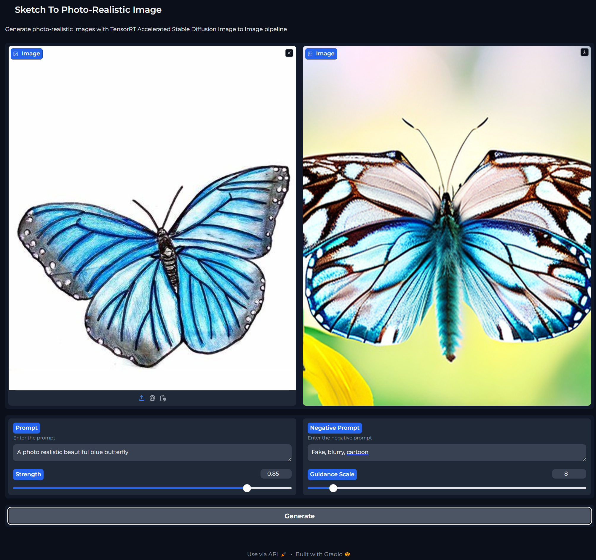
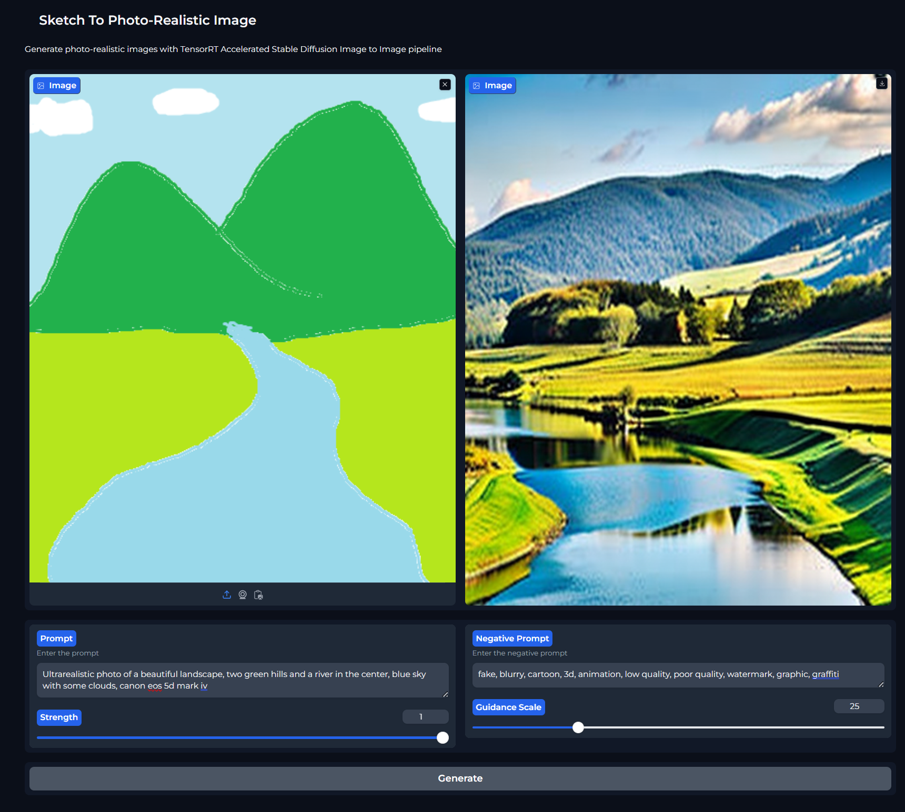

# Sketch To Realistic Image Generation
A Stable Diffusion Image-To-Image Pipeline Accelerated by TensorRT to convert Sketches to Realistic Images.



### Steps to Deploy and Run:
Checkout the code:
```sh
git clone https://github.com/tharakram/Img2Img_SDXL_TRT.git
cd Img2Img_SDXL_TRT
```

Build Docker image:
```sh
docker build .
```

Run the container:
```sh
docker run --gpus all -it -p 7860:7860 --name CONATINER_NAME CONTAINER_ID
```
Application launches on port 7860 after a while, make sure to check the container log to confirm. Once start, hit http://localhost:7860 to launch the gradio application.

**Note:** It takes about ~35-45 minutes when you start the conatiner for the first time since it downloads all the model files and convert them to Tensor Runtime Engine. This repeats if you try to build a new image everytime. Also, feel free to mount the local drive to your container if need be.

#### Configurations for inference calibration:

            prompt:
                The prompt or prompts to guide the image generation.
            strength:
                Conceptually, indicates how much to transform the reference `image`. Must be between 0 and 1. `image`
                will be used as a starting point, adding more noise to it the larger the `strength`. The number of
                denoising steps depends on the amount of noise initially added. When `strength` is 1, added noise will
                be maximum and the denoising process will run for the full number of iterations specified in
                `num_inference_steps`. A value of 1, therefore, essentially ignores `image`. Default value is 0.8.
            guidance_scale:
                Higher guidance scale encourages to generate images that are closely linked to the text `prompt`,
                usually at the expense of lower image quality. Default value is 8.
            negative_prompt:
                The prompt or prompts not to guide the image generation. 
                Ignored when not using guidance (i.e., ignored if `guidance_scale` is less than `1`).

#### Follow the instructions below to run the notebook:
* Install Docker Desktop
* Download and Run TensorRT container from NGC (nvcr.io/nvidia/tensorrt:24.01-py3)
* Run the container in interactive mode by mounting a local directory, please see the below command
    ```sh
    docker run --gpus all -it -p 8000:8000 -v .\LOCAL_DIR\:/CONTAINER_DIR/ nvcr.io/nvidia/tensorrt:24.01-py3
    ```
* Install jupyterlab
    ```py
    pip install jupyterlab
    ```
* Run jupyter lab from the mount workspace [CONTAINER_DIR], it is optional to run the jupyter lab from this workspace, it will be easy to move files from your local to container and otherway around too.
    ```sh
    jupyter lab --port=8000 --no-browser --ip=0.0.0.0 --allow-root
    ```
    **Note:** Jupyter lab port must match your container port, otherwise you will not be able to access the lab from your browser

#### System Specifications:
* CPU (Min 2 Cores)
* Nvidia GeForce RTX 4060 Ti
* Memory 16 GB
* Storage Reqd. ~60GB
* Windows 11 Operating System

#### Command to run the conatiner
```sh
docker run --gpus all -it -p 8000:8000 -v .\LOCAL_DIR\:/CONTAINER_DIR/ nvcr.io/nvidia/tensorrt:24.01-py3
```

#### Another Example with higher strength and guidance scales:


#### References:
* https://docs.nvidia.com/deeplearning/tensorrt/quick-start-guide/index.html#introduction
* https://github.com/huggingface/diffusers/tree/main/examples/text_to_image
* https://github.com/huggingface/diffusers/blob/main/examples/community/README.md
